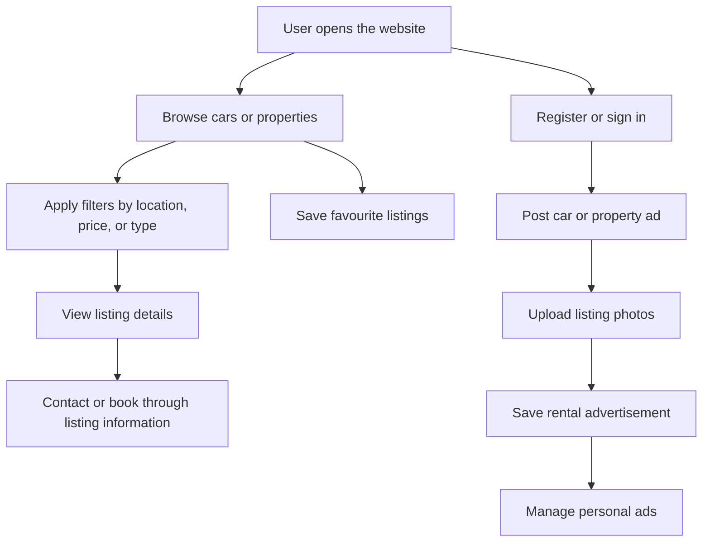
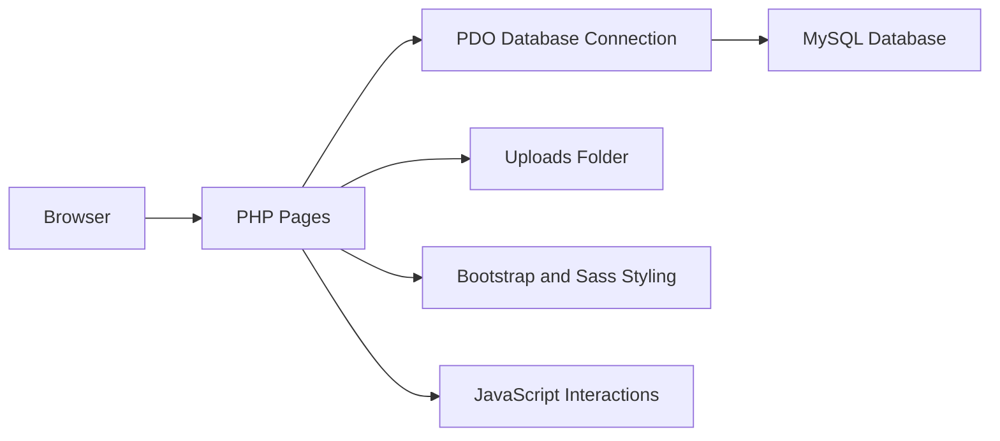

# car and house rental web based

A web-based rental platform for listing, browsing, and managing car and house rental advertisements. The project is built with PHP, MySQL, Bootstrap, Sass, and JavaScript, and is designed to run locally with XAMPP.

The system allows users to register, sign in, browse available cars and properties, filter rental listings, view listing details, post rental advertisements, manage personal ads, save favourites, edit profiles, and submit feedback.

## Project highlights

* Supports 2 main rental categories: cars and houses
* Provides user registration, login, logout, and email verification flow
* Allows users to post car and property rental advertisements
* Supports image uploads for rental listings
* Provides listing filters by location, price, car brand, car category, and house type
* Shows detailed pages for each car and property listing
* Allows users to manage their own posted ads
* Supports favourite car and favourite property pages
* Includes profile editing, password recovery, and feedback pages
* Uses Bootstrap and Sass for responsive page styling

No production security claim is made for the current development stage. Security hardening should be completed before public deployment.

## Problem

People looking for temporary transport or accommodation often need to check different platforms or contact owners manually. This can make it difficult to compare rental options by price, location, category, and availability.

Rental owners also need a simple way to publish car and property advertisements with photos and contact information.

This project addresses these issues by providing a single web-based rental platform with:

* Car rental listing pages
* House and property rental listing pages
* Search and filter controls
* Advertisement posting forms
* User account management
* Favourite listing management
* Listing detail pages with rental information

## Main workflow



## Core features

### 1. Home page

The home page introduces the rental service and shows recent available cars and properties.

It includes:

* Main rental call-to-action
* Latest car listings
* Latest property listings
* Navigation to car rental, property rental, login, profile, and posting pages

### 2. Car rental listing

Users can browse available car rental ads from `car.php`.

The car listing page supports:

* Paginated car results
* Location filtering
* Car brand filtering
* Car category filtering
* Price range filtering
* Car listing cards with image, title, brand, category, and price
* Link to detailed car information

### 3. Property rental listing

Users can browse available house and property rental ads from `property.php`.

The property listing page supports:

* Paginated property results
* Location filtering
* House type filtering
* Price range filtering
* Property listing cards with image, title, type, location, and price
* Link to detailed property information

### 4. Advertisement posting

Signed-in users can post rental advertisements from `post.php`.

The posting flow supports:

* Choosing between car and property advertisement type
* Uploading multiple listing photos
* Entering title, description, price, location, and contact number
* Entering car-specific details such as brand and category
* Entering property-specific details such as house type, bedroom quantity, bathroom quantity, size, and deposit
* Basic form validation before saving the advertisement

### 5. User account flow

The project includes user account pages for:

* Registration
* Login
* Logout
* Email verification
* Forgot password
* Profile view
* Profile editing

### 6. User listing management

Users can manage their own rental content through:

* My car advertisements
* My property advertisements
* Favourite cars
* Favourite properties

### 7. Feedback

Users can submit feedback through the feedback page. This helps collect user comments and service improvement suggestions.

## System architecture



The project is structured as a traditional PHP web application:

1. PHP files handle page rendering and form submission
2. MySQL stores user, car, house, favourite, and feedback data
3. Uploaded listing images are stored in the `uploads/` folder
4. Sass source files are stored in `scss/`
5. Compiled CSS is generated into `css/`
6. JavaScript files provide UI interactions and image previews

## Technology stack

### Frontend

* HTML
* CSS
* Bootstrap 5
* Sass
* JavaScript
* jQuery
* Font Awesome
* Slick Carousel
* Lightbox

### Backend

* PHP
* PDO
* Native PHP sessions
* PHP mail function

### Database

* MySQL
* XAMPP phpMyAdmin

### Development tools

* XAMPP
* Apache
* MySQL
* npm
* Git
* GitHub

## Local development setup

### Prerequisites

Install the following tools:

* XAMPP with Apache and MySQL
* PHP through XAMPP
* Node.js and npm
* Git

### 1. Clone the repository

```bash
git clone https://github.com/KhawVicky/carhouse-rental.git
```

Copy or keep the project inside your XAMPP `htdocs` directory:

```text
C:\xampp\htdocs\CNH-2
```

### 2. Install frontend dependencies

```bash
npm install
```

### 3. Build CSS from Sass

```bash
npm run sass:build
```

For active Sass development, run:

```bash
npm run sass:watch
```

### 4. Create the database

Create a MySQL database named:

```text
renthub
```

The database connection is configured in:

```text
connection.php
```

Default local connection:

```text
Host: localhost
Database: renthub
Username: root
Password: empty
```

### 5. Start XAMPP

Start:

* Apache
* MySQL

### 6. Open the project

Open the website in a browser:

```text
http://localhost/CNH-2/home.php
```

## Main files

| File                  | Purpose                                      |
| --------------------- | -------------------------------------------- |
| `home.php`            | Main landing page and latest listing display |
| `car.php`             | Car rental listing and filtering page        |
| `property.php`        | Property rental listing and filtering page   |
| `detailsCar.php`      | Car listing detail page                      |
| `detailsHouse.php`    | Property listing detail page                 |
| `post.php`            | Car and property advertisement posting page  |
| `signin.php`          | Login page                                   |
| `signup.php`          | Registration page                            |
| `verifyEmail.php`     | Email verification page                      |
| `forgetPass.php`      | Password recovery page                       |
| `profile.php`         | User profile page                            |
| `editProfile.php`     | Profile editing page                         |
| `MyAdCar.php`         | User car advertisement management            |
| `MyAdProperty.php`    | User property advertisement management       |
| `MyFavouriteCar.php`  | Favourite car listings                       |
| `MyFavouriteProperty.php` | Favourite property listings              |
| `feedback.php`        | User feedback page                           |
| `connection.php`      | MySQL database connection helper             |

## Project status

| Area                          | Status      |
| ----------------------------- | ----------- |
| PHP page structure            | Implemented |
| Home page                     | Implemented |
| Car listing page              | Implemented |
| Property listing page         | Implemented |
| Listing detail pages          | Implemented |
| User registration and login   | Implemented |
| Email verification flow       | Implemented |
| Advertisement posting         | Implemented |
| Image upload handling         | Implemented |
| Favourite listing pages       | Implemented |
| Profile editing               | Implemented |
| Feedback page                 | Implemented |
| Sass and Bootstrap workflow   | Implemented |
| Production security hardening | Not started |

## Current scope

The current system focuses on:

* Car rental listings
* House and property rental listings
* User-submitted advertisements
* Listing images
* Filtering and browsing
* User account pages
* Favourite listings
* Local XAMPP deployment

## Limitations

* The project is designed for local XAMPP development.
* A database export file is not currently included in the project folder.
* Passwords are handled in the project code for academic/demo use and should be improved before production use.
* The email verification flow depends on local PHP mail configuration.
* Uploaded files are stored directly in the project `uploads/` directory.
* Additional server-side validation and authorization should be added before real public deployment.

## Future improvements

* Add a complete database schema export
* Hash user passwords securely
* Add stronger server-side validation
* Improve upload file naming and file type checks
* Add admin approval tools for rental advertisements
* Add booking request workflow
* Add owner and renter messaging
* Add responsive UI refinements
* Add deployment configuration for a live server

## Project information

| Item        | Details                        |
| ----------- | ------------------------------ |
| Project     | car and house rental web based |
| Type        | Web-based rental platform      |
| Categories  | Car rental and house rental    |
| Environment | XAMPP local development        |
| Database    | MySQL                          |
| Backend     | PHP                            |
| Frontend    | Bootstrap, Sass, JavaScript    |

## License

This project is developed for academic and educational purposes.
